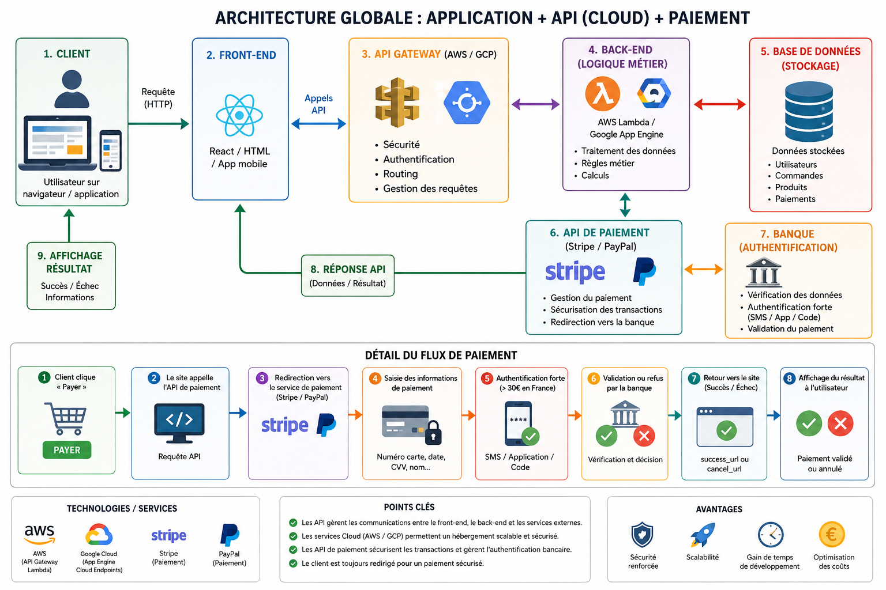

Voici un **récap clair et efficace** de ton cours sur les **API de paiement** 👇

---

# 💳 1. Le paiement en ligne : principe

* Le e-commerce est devenu essentiel → besoin de **solutions de paiement sécurisées**
* Les paiements passent presque toujours par une **API de paiement**

👉 Acteurs principaux :

* Stripe
* PayPal
* MangoPay

---

# 🔄 2. Fonctionnement global d’un paiement

### 🧠 Étapes classiques :

1. Le client clique sur “payer”
2. Il est redirigé vers le service de paiement
3. Il entre ses infos bancaires
4. Il s’authentifie (SMS, app…)
5. Le paiement est validé ou refusé
6. Retour vers le site

---

# 🔐 3. Authentification forte

* Obligatoire en France **au-dessus de 30€**
* Fonctionne comme une **double vérification (2FA)** :

  * SMS
  * application bancaire
  * email

👉 Sans validation → paiement refusé

---

# ⚙️ 4. Choisir une API de paiement

3 cas possibles :

* API imposée par le client
* API préférée du développeur
* API imposée par la plateforme

⚠️ Important :

* vérifier les **frais**
* vérifier les **conditions d’utilisation**
* vérifier la **compatibilité technique**

---

# 💳 5. Exemple avec Stripe

## 🔑 Connexion

* Utilise une **clé API**
* Exemple :

```php
\Stripe\Stripe::setApiKey('clé_api');
```

---

## 🛒 Création d’un paiement

On crée une **session de paiement (checkout)** avec :

* produit
* prix
* quantité
* URLs de succès/échec

👉 Exemple de paramètres :

* `line_items` → produits
* `mode` → type de paiement
* `success_url` → succès
* `cancel_url` → échec

---

## 💡 Types de paiement Stripe

* `payment` → paiement unique
* `subscription` → abonnement
* `setup` → paiement futur

---

# 💰 6. Exemple avec PayPal

## 🔑 Configuration

Nécessite :

* client_id
* client_secret
* email

---

## 🧪 Mode Sandbox

* environnement de test
* faux comptes (client + vendeur)
* aucune vraie transaction

👉 recommandé avant mise en production

---

## ⚙️ Fonctionnement

1. Création d’un objet paiement :

   * montant
   * devise
   * produit
2. Redirection vers PayPal
3. Paiement par l’utilisateur
4. Retour vers le site

---

## 🔁 Données reçues après paiement

* `paymentId`
* `payerId`

👉 permettent de vérifier la transaction

---

# 🔗 7. Éléments importants d’une API de paiement

### 📌 Toujours présents :

* 🔑 authentification (clé API ou credentials)
* 🔁 redirection (succès / échec)
* 💰 montant + devise
* 🛒 détails du panier (souvent)

---

# ⚠️ 8. Bonnes pratiques

* Toujours utiliser le **mode Sandbox** au début
* Lire la **documentation officielle**
* Utiliser une **clé différente par application**
* Sécuriser les clés (ne jamais les exposer)

---

# 🧠 9. Points essentiels à retenir

* Les paiements passent par des **API spécialisées**
* Le client est souvent **redirigé vers le prestataire**
* L’authentification forte est obligatoire
* Stripe = simple et flexible
* PayPal = très connu et rassurant
* Toujours tester avant de passer en réel

---

# 🎯 Conclusion rapide

👉 Flux classique :

```
Client → API paiement → Authentification → Validation → Retour site
```

👉 Pour réussir :

* comprendre le flux
* bien configurer les clés
* tester en Sandbox

---

Voici un **schéma visuel simplifié** du fonctionnement d’une API de paiement 👇

---

# 💳 🌐 Architecture d’un paiement en ligne

```
        👤 Client (Front-end)
               |
               | Clique sur "Payer"
               ↓
        🛒 Site / Application
        (ton front + back)
               |
               | Requête paiement
               ↓
        💳 API de paiement
        (Stripe / PayPal)
               |
               | Redirection sécurisée
               ↓
        🏦 Page de paiement
        - Saisie carte bancaire
        - Infos client
               |
               ↓
        🔐 Authentification forte
        (SMS / App / Code)
               |
               ↓
        ✅ Validation ou ❌ Refus
               |
               ↓
        🔁 API de paiement
               |
               ↓
        🛒 Retour vers site
        - success_url
        - cancel_url
               |
               ↓
        👤 Résultat affiché au client
```

---

# 🔁 Version ultra simplifiée

```
Client → API paiement → Banque → Validation → Retour site
```

---

# ⚖️ Différence rapide Stripe vs PayPal

```
Stripe :
Client → Site → Stripe → Paiement → Retour

PayPal :
Client → Site → PayPal (redirection) → Paiement → Retour
```

---

# 🧠 À retenir visuellement

* 👤 Client → initie le paiement
* 💳 API → gère la transaction
* 🏦 Banque → vérifie et valide
* 🔐 Authentification → sécurise
* 🔁 Retour → informe le site

---

# Système complet : API + Cloud (AWS/GCP) + Paiement

Parfait, voici un **schéma global simplifié** qui combine **API + Cloud (AWS/GCP) + Paiement** 👇

---

# 🌐💳 Architecture complète d’une application moderne

```id="7w4xk2"
        👤 Utilisateur (Navigateur / App)
                      |
                      | Requête (clic, action, paiement…)
                      ↓
        🎨 Front-end (React / HTML / App mobile)
                      |
                      | Appels API (HTTP)
                      ↓
        🌍 API Gateway (AWS / GCP)
        - Sécurité
        - Routing
        - Gestion des requêtes
                      |
        ┌─────────────┴─────────────┐
        ↓                           ↓

⚙️ Logique métier                💳 API Paiement
(AWS Lambda / App Engine)       (Stripe / PayPal)
- Traitement des données         - Gestion paiement
- Calculs                        - Sécurité bancaire
                                - Redirection paiement
        |                           |
        ↓                           ↓

🗄️ Base de données           🏦 Banque
- Users                       - Vérification
- Commandes                   - Authentification (SMS…)
- Produits                    - Validation paiement
        |                           |
        └─────────────┬─────────────┘
                      ↓
              📦 Réponse API
                      |
                      ↓
        🎨 Front-end (mise à jour UI)
                      |
                      ↓
        👤 Résultat affiché à l’utilisateur
```

---

# 🔁 Flux simplifié du paiement dans ce système

```id="3fqy7z"
1. Client clique "payer"
2. Front → API Gateway
3. API → service paiement (Stripe / PayPal)
4. Redirection vers paiement sécurisé
5. Banque + authentification
6. Résultat → API → Front
7. Affichage succès / échec
```

---

# 🧠 Vision globale à retenir

👉 Une app moderne fonctionne comme ça :

* 🎨 Front → affiche et envoie les actions
* 🌍 API → centralise les requêtes
* ⚙️ Back-end → traite la logique
* 🗄️ DB → stocke les données
* 💳 Paiement → géré par un service externe sécurisé

---

# 🎯 Résumé ultra simple

```id="w7q3my"
Client → Front → API → (Logique + Paiement) → Réponse → Client
```

---

