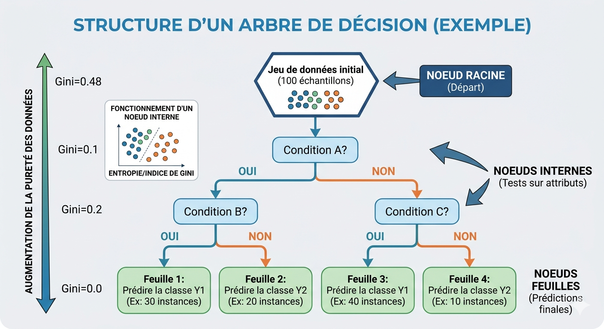
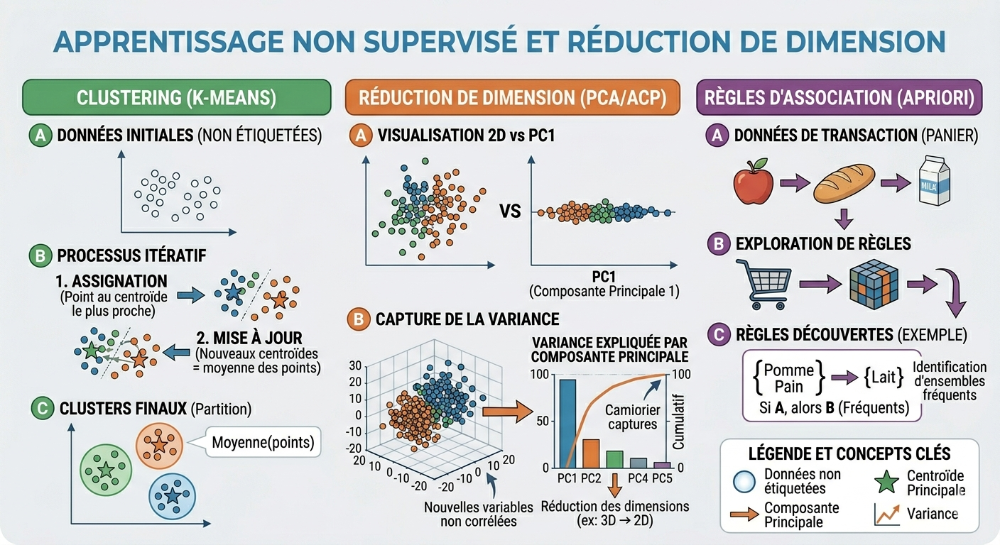
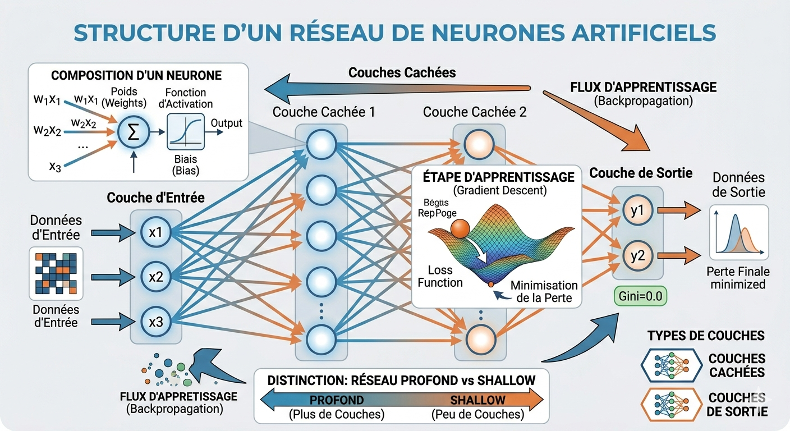

### 1. Fondamentaux et Mathématiques du Machine Learning
* **Algèbre linéaire :** Utilisée pour manipuler de grandes quantités d'informations de manière organisée (comme ranger des photos dans des albums).
* **Calcul différentiel :** Agit comme une boussole pour aider les algorithmes à trouver le meilleur chemin vers un objectif (optimisation).
* **Probabilités :** Outils essentiels pour gérer l'incertitude et évaluer les chances qu'un événement se produise[cite: 532].

### 2. Apprentissage Supervisé : Régression et Classification
* **Régression Linéaire :**
    * **Formule :** $Y = \beta_0 + \beta_1X + \epsilon$.
    * **$\beta_0$ (Bêta zéro) :** L'ordonnée à l'origine (valeur de $Y$ quand $X=0$).
    * **$\beta_1$ (Bêta un) :** La pente, soit le changement moyen de $Y$ pour chaque unité de changement de $X$.
    * **Méthode des moindres carrés :** Technique visant à minimiser la somme des carrés des erreurs (résidus) entre les points observés et la ligne de prédiction.
* **Arbres de Décision :**
    * **Structure :** Composée d'un **nœud racine** (départ avec toutes les données), de **nœuds internes** (tests sur les attributs) et de **nœuds feuilles** (prédictions finales).
    * **Mesures de pureté :** Pour la classification, on utilise l'**indice de Gini** (0 = échantillon homogène) ou l'**entropie**. Pour la régression, on utilise la **variance** ou l'**erreur quadratique moyenne**.
    * **Risques :** Un arbre trop profond risque le **sur-apprentissage** (overfitting), tandis qu'un arbre trop peu profond risque le **sous-apprentissage**.

### 3. Apprentissage Non Supervisé et Réduction de Dimension
* **Clustering (K-means) :**
    * **Processus :** Partitionne les données en $k$ clusters en assignant chaque point au **centroïde** le plus proche, puis met à jour la position des centroïdes par la moyenne des points de manière itérative
* **Réduction de dimension (PCA/ACP) :**
    * Transforme les données en nouvelles variables non corrélées appelées **composantes principales**
    * La première composante capture la plus grande **variance** possible.
* **Règles d'association (Apriori) :** Identifie des ensembles d'articles fréquents (ex: "si A est acheté, alors B est souvent acheté").

### 4. Deep Learning (Apprentissage Profond)
* **Architecture :** Réseaux de neurones artificiels composés de perceptrons organisés en couches (Entrée, Cachée, Sortie).
* **Réseau Profond :** On parle de réseau "profond" dès qu'il contient au moins **deux couches cachées**.
* **Paramètres :** Chaque connexion possède un **poids** et chaque neurone un **biais**.
* **Apprentissage :** Se fait par l'ajustement des poids pour minimiser une **fonction de perte**.

### 5. Mise en Production (Mise en service)
* **Traçabilité :** Cruciale pour savoir avec quel jeu de données et quels paramètres un modèle a été entraîné afin de comparer les versions.
* **Monitoring :** Surveillance nécessaire pour détecter si un modèle devient **obsolète** (ex: changement de comportement des prix) et déclencher un réentraînement.
* **Streamlit :** Librairie Python utilisée pour créer rapidement des interfaces web interactives sans compétences en développement frontend.