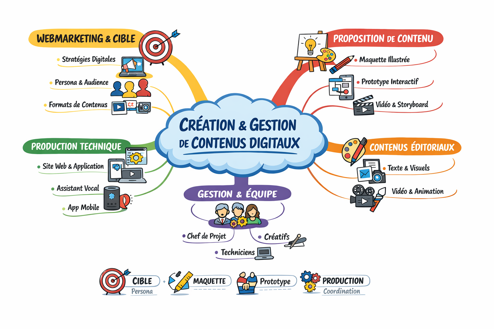

---

# 📚 Résumé  – Production de contenus digitaux  (1ière partie)

---

# I. 🌐 Le contenu digital : environnement et enjeux

## 1. Définition globale

Le **contenu digital** désigne tout contenu (texte, image, vidéo, audio) conçu pour un **environnement numérique interactif**.

👉 Ce qui le différencie du contenu traditionnel :

* il est **dématérialisé**
* il est **diffusable instantanément**
* il est **partageable et interactif**

---

## 2. Transformation du web

### 🔹 Web 1.0 (années 2000)

* Sites vitrines
* Communication **à sens unique**
* Peu d’interaction

### 🔹 Web 2.0

* Réseaux sociaux (Facebook, Twitter, Instagram)
* Contenu participatif
* Interaction utilisateur (likes, commentaires)

### 🔹 Web 3.0

* Assistants vocaux (Siri, Alexa)
* Contenus intelligents et personnalisés
* Nouveaux supports (montres, objets connectés)

👉 Conclusion :
➡️ La communication est devenue **multicanale, rapide et permanente**

---

## 3. Nouveaux enjeux pour les entreprises

Aujourd’hui, une entreprise doit :

* exister **en ligne**
* produire du contenu **régulièrement**
* s’adapter aux supports (mobile, tablette, ordinateur)
* capter l’attention **rapidement**

👉 Avant : 1 site suffisait
👉 Aujourd’hui : il faut une **présence continue et variée**

---

## 4. Les formes de contenus digitaux

Une stratégie digitale repose sur plusieurs formats :

* **Textuel** : blogs, posts
* **Visuel** : design, site web
* **Animé** : vidéos, motion design
* **Audio** : podcasts

👉 Important :
➡️ Plus le contenu est varié, plus l’impact est fort

---

# II. 🎯 Répondre au besoin client

## 1. Une relation basée sur l’écoute

La base du travail = comprendre le client

👉 Cela repose sur :

* communication
* confiance
* échanges

---

## 2. Les 3 grandes étapes

### 1️⃣ Identification du besoin

Il faut poser les bonnes questions :

* **Qui ?** (cible)
* **Quoi ?** (type de contenu)
* **Pourquoi ?** (objectif)
* **Comment ?** (format)
* **Quand ?** (délais)

👉 Objectif : comprendre précisément la demande

---

### 2️⃣ Proposition créative

C’est la phase de **séduction du client**

👉 Il faut :

* être créatif
* proposer des idées originales
* s’appuyer sur des références (cinéma, culture, tendances)
* rester réaliste

👉 L’originalité est un facteur clé de différenciation

---

### 3️⃣ Ajustement et validation

* adaptation au budget
* ajustement technique
* validation finale

👉 C’est souvent un **retour à la réalité**
(car certaines idées coûtent très cher)

---

## 3. Notions essentielles

### 🔹 Le réalisme

Toutes les idées ne sont pas réalisables :

* contraintes techniques
* contraintes financières

---

### 🔹 Le coût de la qualité

👉 Plus un contenu est complexe :
→ plus il demande de temps et de compétences
→ plus il coûte cher

Exemples :

* animation 3D = très coûteuse
* animation 2D ≠ forcément moins chère
* vidéo simple ≠ forcément facile

---

### 🔹 Externalisation

* recours à des freelances
* travail en équipe
* production collaborative

---

# III. 🎨 Le brief créatif et l’orientation artistique

## 1. Définitions

### 🔹 Brief créatif

Analyse complète du besoin client (technique + artistique)

### 🔹 Orientation artistique

Direction créative choisie pour répondre au besoin

👉 C’est le **fil conducteur du projet**

---

## 2. Importance stratégique

Dans un monde saturé de contenus :
👉 avoir une direction claire = **se démarquer**

---

## 3. Les questions fondamentales

* Qui suis-je ? (identité)
* À qui je parle ? (cible)
* Pourquoi ? (objectif)
* Comment ? (message + moyens)

---

## 4. Les 4 piliers du brief

---

### A. 🧍 Identité du client

* nom
* histoire
* valeurs
* image

👉 Influence directe sur la création

#### Cas 1 : entreprise ancienne

* valeurs : tradition, stabilité
* stratégie : rassurer

#### Cas 2 : start-up

* valeurs : innovation, rupture
* stratégie : surprendre

---

### B. 🎯 Cible

4 grandes générations :

* Baby-boomers
* Génération X
* Génération Y (cœur de cible)
* Génération Z

👉 La génération Y est clé :

* pouvoir d’achat
* forte présence digitale

👉 Plus la cible est précise → plus la communication est efficace

---

### C. 🚀 Motivations

#### Interne :

* motiver les équipes
* créer une culture d’entreprise

#### Externe :

* gagner en visibilité
* fidéliser
* attirer

👉 Objectif principal :
➡️ être vu et reconnu

---

### D. 💰 Possibilités

* budget
* moyens techniques
* temps

👉 Idée essentielle :
➡️ adapter la stratégie aux ressources

---

# IV. 🎬 Définir une orientation artistique

## 1. Construction

Elle repose sur :

* le brief
* les tendances
* le budget

👉 Objectif :
➡️ créer une cohérence globale

---

## 2. Types de contenus

* site web
* réseaux sociaux
* vidéo
* animation

👉 Tous doivent être cohérents entre eux

---

## 3. Le rôle central du logo

Le logo est le cœur de l’identité visuelle

### Un bon logo doit être :

* simple
* unique
* cohérent
* intemporel
* adaptable
* mémorable

👉 Il doit fonctionner partout :

* site
* mobile
* réseaux
* vidéo

---

# V. 🛠️ La pré-production

## 1. Définition

Phase de préparation avant la production

👉 Objectif :
➡️ organiser et sécuriser le projet

---

## 2. Les outils essentiels

---

### 📅 Rétro-planning

* calendrier de production
* organisation des étapes
* gestion du temps

👉 Respecter le planning = respecter le budget

---

### 📄 Cahier des charges

* document de référence
* fixe :

  * objectifs
  * contraintes
  * attentes

👉 Il encadre toute la création

---

### 🔍 Étude concurrentielle

* analyse du marché
* identification des tendances

👉 Objectif :
➡️ se positionner intelligemment

⚖️ équilibre :

* trop original → rejet
* trop classique → banalité

---

### 🎨 Conception et retouches

* création d’une V1 (première version)
* corrections fréquentes
* validation progressive

👉 Important :
➡️ les modifications sont normales et prévues

---

# VI. 💻 Spécificités du contenu interactif

## 1. Particularités

* évolutif
* technique
* nécessite maintenance

---

## 2. Étapes spécifiques

* maquette
* version bêta
* tests
* corrections
* mises à jour

👉 Le projet continue après livraison

---

# VII. 🧠 Idées clés à retenir (ultra important)

* Le digital est **indispensable**
* La production est **continue**
* Le brief est **fondamental**
* La création = **équilibre entre créativité et contraintes**
* Le budget influence fortement les choix
* La pré-production est **cruciale**
* Les retouches font partie du processus
* Le contenu interactif est **évolutif**

---

# 🧾 Conclusion générale

La production de contenu digital repose sur 3 piliers :

### 🎯 Stratégie

→ comprendre le besoin

### 🎨 Créativité

→ proposer une direction artistique

### 🛠️ Organisation

→ produire efficacement

👉 Ce n’est pas juste créer :
➡️ c’est **concevoir, structurer et adapter**

---

Parfait 👍 voici une **carte mentale claire et structurée** que tu peux facilement mémoriser ou recopier.

---

# 🧠 CARTE MENTALE – Production de contenus digitaux

```
PRODUCTION DE CONTENUS DIGITAUX
│
├── 1. CONTENU DIGITAL
│   ├── Définition
│   │   → Contenu numérique interactif (texte, image, vidéo, audio)
│   │
│   ├── Évolution du web
│   │   ├── Web 1.0 → sites vitrines
│   │   ├── Web 2.0 → réseaux sociaux
│   │   └── Web 3.0 → assistants vocaux, IA
│   │
│   └── Types de contenus
│       ├── Textuel
│       ├── Visuel
│       ├── Vidéo / animation
│       └── Audio
│
├── 2. BESOIN CLIENT
│   ├── Étapes
│   │   ├── Identification
│   │   ├── Proposition
│   │   └── Ajustement / validation
│   │
│   ├── Questions clés
│   │   ├── Qui ?
│   │   ├── Quoi ?
│   │   ├── Pourquoi ?
│   │   ├── Comment ?
│   │   └── Quand ?
│   │
│   └── Contraintes
│       ├── Budget
│       ├── Temps
│       └── Technique
│
├── 3. BRIEF CRÉATIF
│   ├── Définition
│   │   → Analyse du besoin
│   │
│   ├── Orientation artistique
│   │   → Direction créative
│   │
│   └── 4 piliers
│       ├── Identité
│       │   → histoire, valeurs
│       │
│       ├── Cible
│       │   → générations (X, Y, Z)
│       │
│       ├── Motivations
│       │   ├── Interne
│       │   └── Externe
│       │
│       └── Possibilités
│           → budget, moyens
│
├── 4. ORIENTATION ARTISTIQUE
│   ├── Cohérence globale
│   ├── Adaptation aux tendances
│   └── Types de contenus
│
│   └── LOGO (élément central)
│       ├── Simple
│       ├── Unique
│       ├── Cohérent
│       ├── Intemporel
│       └── Adaptable
│
├── 5. PRÉ-PRODUCTION
│   ├── Rétro-planning
│   │   → organisation du temps
│   │
│   ├── Cahier des charges
│   │   → contraintes + objectifs
│   │
│   ├── Étude concurrentielle
│   │   → tendances + positionnement
│   │
│   └── Conception
│       ├── Version 1 (V1)
│       └── Retouches
│
├── 6. TYPES DE CONTENUS
│   ├── Illustré (logo, graphisme)
│   ├── Animé (vidéo, motion design)
│   └── Interactif (site, appli)
│
└── 7. CONTENU INTERACTIF
    ├── Maquette
    ├── Version bêta
    ├── Tests
    ├── Corrections
    └── Maintenance (évolution continue)
```

---

## 🧾 Astuce pour mémoriser facilement

👉 Pense en **3 grandes étapes** :

1. **Comprendre** → besoin + brief
2. **Créer** → orientation artistique
3. **Organiser** → pré-production + outils

---


---

# 🧠 SYNTHÈSE GLOBALE – CRÉATION & GESTION DE CONTENUS DIGITAUX (2ièeme partie)

---

# 1. 🎯 Le webmarketing et la création de contenu

## 📌 Définition

Le **webmarketing** = ensemble des techniques marketing utilisées sur internet pour :

* attirer des visiteurs
* les convertir en clients
* les fidéliser 

👉 La **création de contenu digital** consiste à produire du contenu utile et pertinent pour répondre aux besoins des utilisateurs.

---

## 🚀 Objectifs du contenu digital

* Attirer des prospects (leads)
* Créer une relation de confiance
* Convertir en clients
* Fidéliser sur le long terme 

---

## 📊 Les 4 grandes stratégies du marketing digital

1. **Marketing de contenu** → articles, vidéos, images
2. **Marketing social** → réseaux sociaux, interaction
3. **Search marketing** → SEO / référencement
4. **Marketing mobile** → optimisation smartphone 

---

## 🧩 Les étapes d’une stratégie webmarketing

1. Analyse de la concurrence
2. Définition de la cible (persona)
3. Objectifs SMART
4. Choix des canaux (site, réseaux, etc.)
5. Définition du budget 

---

## 🎯 Importance de la cible

* Il faut viser un **client idéal (persona)**
* Adapter le contenu à ses besoins
* Choisir le bon format (vidéo, podcast, article…)

👉 Un bon contenu :

* éduque le client
* réduit les hésitations
* améliore la conversion 

---

## 📦 Types de contenus digitaux

* Articles de blog (SEO)
* Visuels
* Vidéos (très efficaces)
* Infographies
* Podcasts
* Livres blancs
* Études de cas
* Webinaires 

---

# 2. 🎨 La proposition de contenu digital (maquettes)

## 📌 Rôle de la maquette

Une **maquette** = ébauche du contenu final
👉 Elle sert à :

* convaincre le client
* valider une direction artistique
* lancer la collaboration 

⚠️ Moment clé : si la proposition est réussie → relation client facilitée

---

## 🖌️ 3 types de contenus à maquetter

---

### 1. Contenu illustré (graphisme)

Ex : logo, charte graphique, illustrations

👉 À fournir :

* croquis / esquisses
* différentes directions artistiques
* version papier + digitale

💡 Astuce :

* proposer plusieurs styles pour guider le client
* combiner dessin + numérique 

---

### 2. Contenu interactif (site, app)

👉 À fournir :

* schémas de navigation (UX)
* croquis d’interface (UI)
* prototype testable

📌 Le **prototype** est essentiel :
→ version test que le client peut utiliser 

---

### 3. Contenu animé (vidéo, animation)

👉 À fournir :

* synopsis (résumé rapide)
* storyboard (quelques scènes)
* prototype vidéo (pilote)

💡 Important :

* ne pas faire un scénario complet (trop complexe)
* montrer une idée claire et visuelle 

---

# 3. 🏗️ La gestion de production des contenus digitaux

## 📌 Rôle du chef de projet

* organiser la production
* gérer les équipes
* respecter délais et budget
  👉 objectif : produire le meilleur contenu possible 

---

## 🌐 Production de contenus techniques

### 🔹 Site web

* nécessite : web designer + développeur
* outils modernes : WordPress, Wix
* importance du design + fonctionnalités 

---

### 📱 Application mobile

* UX designer → expérience utilisateur
* UI designer → interface visuelle

👉 application = extension du site web 

---

### 🎙️ Applications vocales (Alexa, etc.)

* UX + développeur + voix (doublage)
* importance de l’expérience sonore 

---

## ✍️ Production de contenus éditoriaux

### 📄 Contenu textuel

* articles, posts réseaux sociaux
* objectif : animer une communauté

👉 rôle clé : **Community Manager**

* crée du contenu
* suit les tendances
* engage la communauté 

---

### 🎨 Contenu visuel

* logo, charte graphique, design
* cohérence visuelle essentielle

👉 rôle clé : **graphiste**

* créatif + technique
* pilier de l’identité de marque 

---

## 🎬 Production vidéo et animation

### 🎥 Vidéo

* contenu le plus efficace aujourd’hui
* mélange image + son

👉 équipe :

* réalisateur (chef créatif)
* cadreur
* monteur

---

### 🔄 Post-production

* montage
* effets visuels
* habillage graphique

👉 impact direct sur la qualité finale 

---

# 🧩 À RETENIR (SUPER IMPORTANT)

### 🔑 1. Le contenu digital = stratégie marketing

→ il sert à attirer, convaincre et fidéliser

### 🔑 2. La cible est centrale

→ tout contenu doit être adapté au persona

### 🔑 3. La maquette est indispensable

→ elle permet de convaincre le client

### 🔑 4. La production = travail d’équipe

→ créatifs + techniques

### 🔑 5. Le contenu doit être :

* pertinent
* cohérent
* régulier
* adapté au canal

---



---

# 🧠 Synthèse – Le Workflow

## 1. 📌 Définition et rôle du workflow

Un **workflow (flux de travail)** est une **suite d’actions automatisées** déclenchées par un événement (ex : inscription à une newsletter).

👉 Objectif :

* Transformer une stratégie en actions concrètes
* Automatiser des tâches répétitives (emails, relances…)
* Améliorer l’efficacité et la performance

👉 Il fonctionne comme un **scénario** :

* Déclencheur (point de départ)
* Actions (emails, segmentation…)
* Conditions (si / sinon)
* Résultats

---

## 2. ⚙️ Utilité du workflow en marketing

Le workflow est central dans le **marketing automation** :

✔ Gain de temps
✔ Automatisation des tâches répétitives
✔ Personnalisation des messages
✔ Meilleure conversion des prospects en clients

👉 Il permet de :

* Segmenter les contacts selon leur comportement
* Envoyer du contenu ciblé
* Suivre le parcours client

---

## 3. 🔄 Types de workflows

### 🟢 Workflow de bienvenue

* Déclenché après une inscription
* Envoie un email de bienvenue

### 📅 Workflow d’événement

* Pour webinaires / ateliers
* Emails de confirmation, rappel, suivi

### 🔁 Workflow de relance

* Pour contacts inactifs ou paniers abandonnés
* Envoie des relances automatiques

### 🎯 Autres workflows

* Anniversaire (offres promo)
* Fidélisation client
* Segmentation automatique

---

## 4. 🧩 Autres formes de workflow (organisation)

* **Workflow agile** : gestion par objectifs courts (jour/semaine)
* **Workflow de demandes entrantes** : gestion de flux (ex : support client)
* **Workflow de transfert** : passage de tâches entre collaborateurs

---

## 5. 🛠️ Étapes de création d’un workflow

### 1. Définir les objectifs et la cible

* Qui ? (persona)
* Pourquoi ? (objectif marketing)

### 2. Créer le contenu

* Emails, offres, messages
* Doit être pertinent et attractif

### 3. Choisir les outils

Exemples :

* HubSpot
* ActiveCampaign
* Omnisend

### 4. Définir les actions

* Envoi d’emails
* Délais entre actions
* Ajout/suppression de contacts
* Notifications internes

### 5. Analyser les performances

* Les objectifs sont-ils atteints ?
* Les prospects réagissent-ils ?
* Ajuster si nécessaire

---

## 6. ⚠️ Points de vigilance

❗ Mauvais paramétrage = problèmes :

* Boucles infinies (workflow qui se relance sans fin)
* Conflits entre workflows
* Messages inadaptés

👉 Solutions :

* Bien choisir les déclencheurs
* Ajouter des conditions d’exclusion
* Tester avant mise en place

---

## 7. 📊 Conditions de réussite

✔ Avoir des objectifs clairs
✔ Bien segmenter les contacts
✔ Disposer de contenus variés
✔ Adapter les messages aux cibles
✔ Analyser et optimiser régulièrement

---

## 8. 💡 Rôle stratégique du workflow

Le workflow permet de :

* Transformer des visiteurs en prospects
* Personnaliser l’expérience client
* Optimiser le tunnel de conversion
* Automatiser la relation marketing

👉 Il remplace les campagnes de masse par une approche **ciblée et intelligente**.

---

## 9. 🧾 À retenir (ultra résumé)

👉 Un workflow =
➡️ Déclencheur + Actions automatisées + Conditions

👉 Objectif :
➡️ Automatiser + Personnaliser + Convertir

👉 Clé du succès :
➡️ Bonne segmentation + bon contenu + bon timing

---

