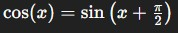

### 1) Ce que représentent ces fonctions

Les fonctions :

* (y = \sin(x))
* (y = \cos(x))

sont des **ondes** qui montent et descendent régulièrement entre -1 et 1.

👉 Imagine une vague :

* elle monte → redescend → remonte → etc.
* c’est exactement ce que font ces fonctions

---

### 2) La vraie idée de l’exercice

On ne te demande pas vraiment de faire des maths compliquées.

👉 Le but est simplement :
**comparer visuellement deux courbes**

Et découvrir que :

* elles ont la **même forme**
* mais elles sont **décalées**

---

### 3) Le décalage (le point important)

Voici l’idée clé :




👉 Traduction simple :

* cos(x) = sin(x), mais **décalé vers la gauche**
* le décalage est de **π/2 radians (90°)**

---

### 4) Pourquoi utiliser des subplots ?

Un subplot = plusieurs graphiques dans la même fenêtre

👉 Ici :

* graphique du haut → sin(x)
* graphique du bas → cos(x)

Pourquoi c’est utile ?

* tu peux comparer **facilement**
* tu vois que les pics ne sont pas au même endroit
* donc tu comprends le décalage

👉 Si tu les mets sur le même graphique, ça marche aussi
Mais les subplots rendent la comparaison **plus claire visuellement**

---

### 5) Ce que fait ton code (version simple)

Ton code :

1. crée des valeurs de x
2. calcule sin(x) et cos(x)
3. trace deux graphiques :

   * en haut → sin
   * en bas → cos

---

### 6) Version simplifiée du code (plus propre)

Ton code peut être simplifié comme ça :

```python
import matplotlib.pyplot as plt
import numpy as np

x = np.linspace(0, 4*np.pi, 100)

y1 = np.sin(x)
y2 = np.cos(x)

plt.subplot(2,1,1)
plt.plot(x, y1)
plt.title("sin(x)")
plt.grid()

plt.subplot(2,1,2)
plt.plot(x, y2)
plt.title("cos(x)")
plt.grid()

plt.show()
```

👉 Même résultat, mais beaucoup plus simple

---

### 7) Résumé ultra simple

* sin(x) et cos(x) = deux vagues
* elles sont **identiques mais décalées**
* les subplots servent à **les comparer facilement**

---

C'est une excellente question. Cette ligne est la "colonne vertébrale" de ton graphique. Pour tracer une courbe, l'ordinateur a besoin de points (comme les points que tu relies à la main sur du papier millimétré).

`np.linspace` est l'outil qui crée ces points automatiquement.

---

### Décortiquons la commande : `np.linspace(début, fin, nombre_de_points)`

Voici ce que signifie chaque partie dans ton code : `np.linspace(0, 4*np.pi, 100)`

1.  **`0` (Le début) :** On commence à l'angle 0.
2.  **`4*np.pi` (La fin) :** On s'arrête à $4\pi$. Comme un tour complet de cercle fait $2\pi$, ici on demande de dessiner **deux tours complets** (deux vagues entières).
3.  **`100` (La précision) :** On demande à Python de placer **100 points** entre le début et la fin.

---

### Pourquoi c'est indispensable ?

L'ordinateur ne sait pas dessiner une courbe "lisse" par magie. Il dessine des petits segments droits entre chaque point.

* Si tu mets **5 points** : ta vague ressemblera à des zigzags tout moches.
* Si tu mets **100 points** : les segments sont si petits que l'œil croit voir une courbe parfaite.


### Ce qu'il y a vraiment dans la variable `x`

Si tu demandais à Python d'afficher `x`, tu verrais une liste de nombres (un "tableau") :
`[0.0, 0.12, 0.25, ... , 12.56]`

C'est comme si tu disais à Python :
> "Prépare-moi une règle graduée qui va de 0 à $4\pi$, et fais en sorte qu'il y ait exactement 100 graduations régulières."

Ensuite, quand tu calcules `y = np.sin(x)`, Python calcule le sinus pour chacun de ces 100 points. C'est ce qui permet de tracer le graphique !

---
